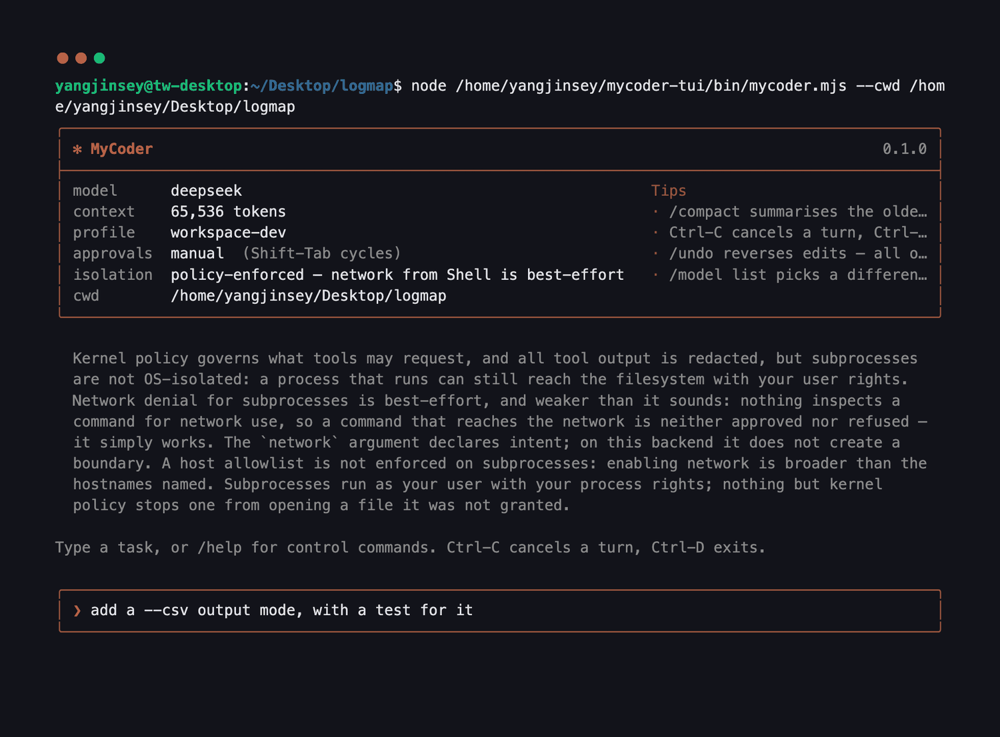

<div align="center">

# MyCoder

**A coding agent for your terminal that asks before it acts — and tells you what it cannot promise.**

**English** · [简体中文](README.zh-CN.md)


<sub>A real session, recorded on an Ubuntu VM. Nothing here is a mock-up.</sub>

</div>

---

## Why this one

**It shows you the decision, not a confirmation.** When it wants to run a command
or touch a file, you get what it intends to do, to which files, over which network
destination, and how long the permission lasts. The highlight starts on _No_, and
walking away means no.

**It does not overstate what it is protecting you from.** Most agents say
"sandboxed". This one prints, at startup and in `/status`, one enforcement level
per dimension — and refuses to say "enforced" about anything that is only policy.
If subprocess network denial is best-effort on your setup, it says so before you
type anything.

**It is one process and nothing else.** Zero runtime dependencies. Node 22.18+,
and that is the entire supply chain.

## Install

```bash
npm install -g ./mycoder-0.1.0.tgz
mycoder doctor
```

`doctor` reaches one of exactly two conclusions and never a third: **ready**, or
**blocked** — while naming the file to create, the key to set, and how to check it
worked. It builds no session and writes nothing, because it is the command you
reach for when `mycoder` itself will not start.

## Point it at a model

MyCoder talks to Anthropic, OpenAI, and anything speaking the OpenAI-compatible
Chat API (DeepSeek, Together, OpenRouter, a local llama.cpp server). Put the key
somewhere the kernel can read and nothing else can:

```bash
printf %s "$YOUR_API_KEY" | mycoder setup-credential ~/.config/mycoder/secrets/deepseek.key
```

It reads from stdin and refuses to read from the terminal, so your key is never
echoed to the screen — and it sets the file's permissions itself.

Then name the provider in `~/.config/mycoder/config.toml`:

```toml
[model.provider.deepseek]
protocol     = "openai-chat"
base_url     = "https://api.deepseek.com"
api_key_file = "secrets/deepseek.key"

[model.alias.deepseek]
provider = "deepseek"
model    = "deepseek-chat"

[model]
default = "deepseek"
```

`docs/configuring-a-provider.md` has a worked example, a reference for every
field, and the local-model variant; `mycoder doctor` will name the line that is
wrong if one is.

## Use it

Run `mycoder` in the project you want to work on. It opens with what it is about
to do this session — the model, how much context it has, which permission profile
is in force, whether it will ask before acting, and what the isolation actually is.



Then type what you want. Plain sentences; no prompt format to learn.

| While you type      |                                                                 |
| ------------------- | --------------------------------------------------------------- |
| `@src/thing.ts`     | attach a file — Tab completes it                                |
| `/`                 | a control command — Tab completes those too, `/help` lists them |
| `!npm test`         | show how that command would be parsed, without running it       |
| **Shift-Tab**       | cycle how much it is allowed to do without asking               |
| **Ctrl-C / Ctrl-D** | cancel this turn / leave                                        |

**Watch it work.** One line per tool call, one per result. When it calls several
tools at once, each result says which call it belongs to — they come back in
whatever order they finish.


**Answer the questions it asks.** Arrow keys, or type the number.


If you would rather not be asked about every edit, **Shift-Tab** moves through
`plan` → `manual` → `accept-edits` → `auto`. `accept-edits` applies edits inside
the workspace without asking and still asks about everything else. `plan` cannot
change anything at all. No mode can approve something the permission profile
denied — credentials, network, git history and foreign tools ask in every one.

**See what it did.** A turn ends with what actually happened, counted from the
events rather than from the model's summary of itself — and anything it was
refused, listed separately.


### Between sessions

```bash
mycoder -c                        # continue this project's last session
mycoder -r                        # pick from recent ones, listed by what you asked
mycoder "fix the failing test"    # one task, then exit
mycoder --json "…"                # one JSON object per line, for scripts
mycoder --read-only "…"           # it may look, and may not touch
```

### When it gets something wrong

`/undo` reverses the last edit, the last turn's edits, or a file's — restoring the
exact prior bytes. It refuses rather than guessing if the file changed underneath,
it reverses all of a set or none of it, and it tells you what it did **not** cover:
a shell command's side effects, and anything from before the session started.

## What it can do

**Nine core tools:** `Read`, `Grep`, `Glob`, `Edit`, `Write`, `Delete`, `Move`,
`Shell`, `GitDiff` — all behind one contract that separates what a tool intends
from doing it, so permission is decided before anything happens. Deletion asks
where an ordinary write does not. `WebFetch` appears only if you name a host it
may reach.

**It cannot edit a file it has not read.** Every edit must cite the read that
showed the model the region it is changing, so an edit against content that moved
is refused instead of silently applying to the wrong lines.

**Writes are atomic**, with a unified diff, rollback metadata and your line endings
preserved.

**Secrets are handled as secrets.** Paths that hold them are denied outright, tool
output is scanned before the model sees it, and keys are held in a broker whose
leases cannot be turned back into the value by printing them.

**Every outbound byte goes through one gate**, with a host allowlist per channel.
Telemetry is metadata-only, and `--no-telemetry` turns it off.

**Long jobs stay bounded.** `/loop` sets a step, time and cost budget for a turn;
`/compact` summarises the older conversation when context runs short; `/status`
shows what has been spent.

**It can run somewhere else.** `--remote` executes tools over SSH; `--backend
container` runs commands in a container with your home directory and credentials
absent rather than merely denied.

**It can be extended by a repository** — skills, subagents and hooks discovered
from the project — under a rule that a definition may only ever narrow what is
permitted, never widen it.

## What you are trusting

The whole point of the startup banner is that this section is not a surprise.

On the **local** and **SSH** backends MyCoder is `policy-enforced`, **not**
`os-isolated`. The kernel decides what tools may request and redacts what they
return, but a command that runs is a normal process with your user's rights: it
can reach the filesystem, and "network is off" is best-effort — nothing inspects a
command for network use, so one that reaches the internet is neither approved nor
refused. It simply works.

`--backend container` changes that for commands, and only for commands. They run
with a read-only root filesystem, dropped capabilities, `no-new-privileges`, no
network unless something granted it, and your home and credential directories
absent from the container rather than denied inside it. Reading and editing files
is still done by the kernel on your real filesystem, and is still reported as
`policy-enforced` — because that is what it is.

`docs/threat-model.md` is the long version, including what an attacker who owns
the repository you point this at can and cannot do.

## Not in this version

No MCP marketplace, agent teams, IDE plugin, browser control, embeddings or repo
map, model routing, cloud sync, or background daemon. Each has somewhere to attach
later; none is half-built and in the way now.

## When something goes wrong

`mycoder doctor` first — it is written for exactly this moment.

Exit codes are a contract, not decoration. **1** means the model did not finish —
gave up, hit a budget, was cancelled. **3** is your configuration, **4** is
something policy denied, **5** is your machine, **6** is a bug in MyCoder. Nothing
goes above 6, because `127` and `>=128` belong to the shell. A wrapper script can
tell those apart without reading English; `docs/cli-contract.md` lists all of them
and promises they do not change within `0.1.x`.

## More

|                                  |                                                             |
| -------------------------------- | ----------------------------------------------------------- |
| `docs/installing.md`             | supported platforms, and the first run in detail            |
| `docs/configuring-a-provider.md` | a worked example per protocol                               |
| `docs/cli-contract.md`           | every flag and exit code, and what is guaranteed            |
| `docs/web-access.md`             | turning on `WebFetch`, and what it will not do              |
| `docs/threat-model.md`           | what this defends against, and what it does not             |
| `docs/development.md`            | building it, testing it, and how the repository is laid out |
