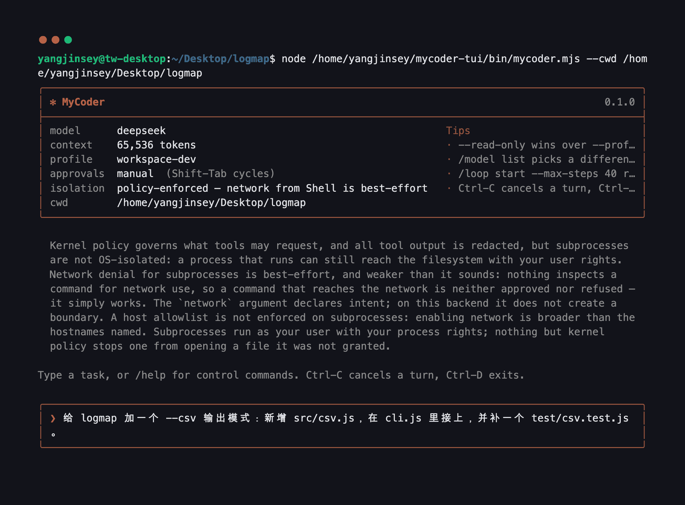
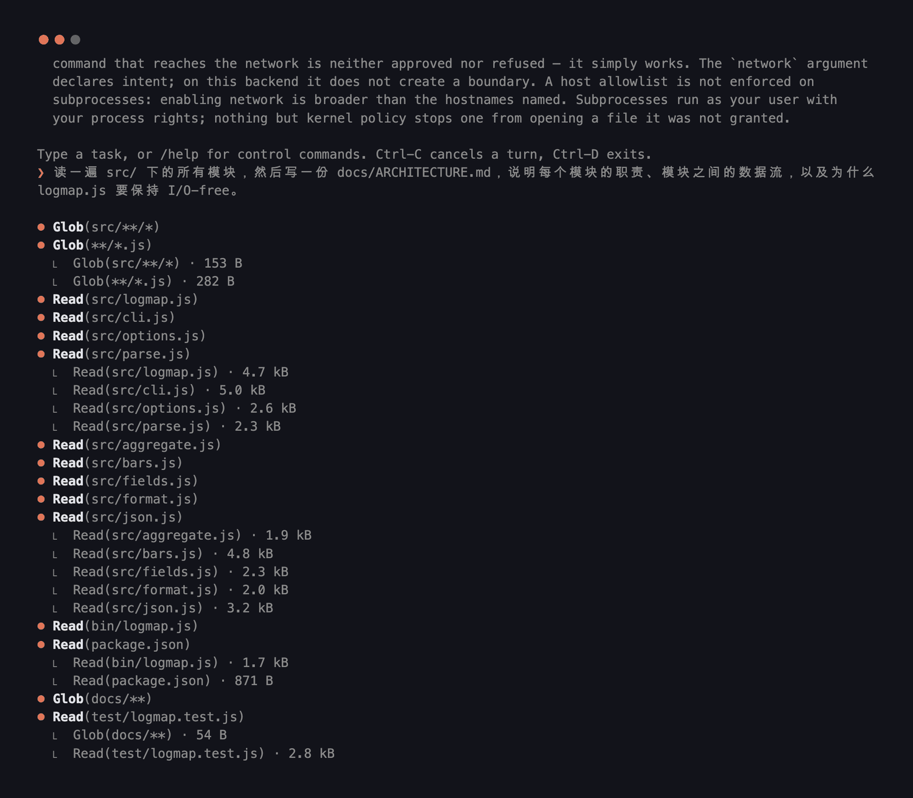
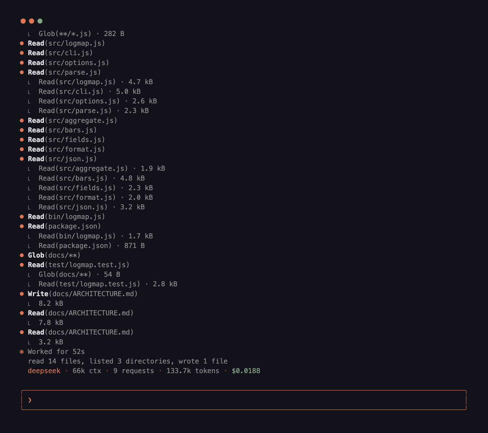

<div align="center">

# MyCoder

**一个编码 agent 内核 —— 小、可验证，并且对自己的安全边界在哪里说得清清楚楚。**

[English](README.md) · **简体中文**


<sub>真实会话，录制于一台 Ubuntu 虚拟机，模型是 DeepSeek。这里没有任何一张是效果图。</sub>

</div>

---

目标不是复刻某个产品的功能清单，而是一个**小、可验证、并且明确说出自己的安全边界在哪里**的内核 ——
以及边界不在哪里。

```
User / CLI
    ↓
Control Plane ──────────────────────────────┐
    ↓                                       │
Session / Turn Coordinator                  │
    ↓                                       │
Step Engine                                 │
 ┌──┼──────────────┐                        │
 ▼  ▼              ▼                        │
Context  Model Runtime  Tool Runtime        │
Engine        │              │              │
              ▼              ▼              │
        Egress Gate    Tool.resolve()       │
                             │              │
                             ▼              │
                       Policy Engine        │
                             ↓              │
                      Sandbox Planner       │
                             ↓              │
                      Executor / Backend ◄──┘
                             ↓
                       Audited Result
```

## 一次会话长什么样

下面每一张都是终端截图，用 `tmux capture-pane` 从真实运行里抓的 —— 和这个里程碑的证据出自同一批会话。

**在向你要任何东西之前，它先说清自己是什么。** 模型、上下文窗口、权限档、审批模式，以及那一行不是装饰的
—— 隔离级别到底是什么，用的是后端自己的描述符，而不是一句让人安心的字面量。



顺带一提，上面那个输入框是按**显示列宽**排版的，所以一行中文和一行 ASCII 在同一列收口 —— 这是很多终端
前端第一个做错的地方。

**一轮工作会把过程摊开。** 每次工具调用一行，每个结果一行。当一步里并行调用了多个工具，每个结果都会标出
自己属于哪次调用 —— 因为它们是按完成顺序回来的，按位置去读不只是没用，是错的。



**审批是一个决定，不是一次确认。** 它展示工具想做什么、动哪些文件、连哪个网络地址、这次授权持续多久。
高亮默认停在 `No`，中途放弃也等于拒绝。


**一轮结束时它会说自己做了什么** —— 数字来自它实际发出的事件，而不是模型对自己的转述 ——
被拒绝的部分单独列出，因为把没发生的事算进总数，是一份小结里不诚实的那一半。



## 安装

Node **22.18 或更新**，除此之外什么都不需要 —— **零运行时依赖**（ADR-0009）。
支持平台矩阵和首次运行流程见 `docs/installing.md`。

```bash
npm install -g ./mycoder-0.1.0.tgz   # 交给你的那个产物
mycoder doctor                       # 要么就绪，要么被挡住并给出确切的修复办法
```

构建这个产物是维护者的步骤，不是安装步骤：在 checkout 里跑 `pnpm release:pack` 就会产出上面的 `.tgz`。

`doctor` 只会得出两个结论之一，不会有第三个：就绪，或者被挡住 —— 并且指出要创建哪个文件、要设哪个 key、
怎么验证。它不会建立任何会话，也不会改动磁盘上任何东西，因为它正是 `mycoder` 起不来时你会去敲的那条命令。

退出码是一份契约 —— `3` 是你的配置有问题，`5` 是你的机器有问题。见 `docs/cli-contract.md`。

## 从 checkout 里跑

```bash
node bin/mycoder.mjs --help
node bin/mycoder.mjs --print-config
node bin/mycoder.mjs -m fake "fix the failing test"      # 离线，脚本化的模型
node --test "tests/**/*.test.ts"
```

checkout 会直接加载 `src/*.ts`，这需要一个带类型擦除的 Node。大多数发行版的都带；Debian 和 Ubuntu 的
不带，而版本号看不出这件事 —— 所以 `mycoder` 会去查 `process.features.typescript`，直接告诉你是两件事
里的哪一件出了问题，而不是死在 `ERR_UNKNOWN_FILE_EXTENSION` 上。`npm run build` 会写出 `dist/`，
任何受支持的 Node 都能加载它。

类型检查需要一个编译器，这也是这个仓库唯一安装的东西：

```bash
pnpm install        # typescript + @types/node，仅有的两个 devDependencies
pnpm typecheck
pnpm eval           # 规范 §27.2 的黄金任务
pnpm package:check  # 产物里实际会包含什么
```

Node 的类型擦除只检查语法可擦除，所以 `pnpm typecheck` 是唯一真正验证类型的步骤。
开 PR 前跑一遍 —— CI 会跑。

## v0.1 做到了什么

- Session / Turn / Step 生命周期，由一个强制的状态机管着。
- 流式模型运行时，跑在一层协议无关的 IR 上，适配 Anthropic Messages、OpenAI Responses 和
  OpenAI 兼容的 Chat 协议 —— 外加一个 `FakeModel`，让整个内核可以离线测试。
- 九个核心工具：`Read`、`Grep`、`Glob`、`Edit`、`Write`、`Delete`、`Move`、`Shell`、`GitDiff`，
  全部走
  `ToolDefinition → ToolExecution → AccessRequest` 这套两阶段契约。`Write` 和 `Delete` 需要一张
  覆盖完整的读取回执；删除是一项独立能力，所以它会在普通写入不问的地方发问（ADR-0016）。
- `WebFetch`，只有当 `[egress] web` 指名了主机时才注册 —— 只允许 GET、不跟随重定向、响应一律按不可信
  输入处理（ADR-0017，`docs/web-access.md`）。
- 权限档（`workspace-dev`、`read-only`、`review`）按能力**取交集**组合，所以没有任何一层能放宽另一层。
- 敏感路径拒绝、内容层面的密钥扫描、一个内存里的 secret broker（它的租约无法被字符串化回原值），
  以及环境变量清洗。
- 所有出站字节都过同一道 egress gate，按通道分别配置主机白名单，遥测通道只走元数据。
- 一本新鲜度账：一次 `Edit` 必须引用那次让模型看到该区域的 `Read`。
- 原子写入，带 unified diff、回滚元数据和行尾保持。
- **Undo** —— 撤销一次编辑、一轮的编辑，或一个文件的编辑，恢复到完全相同的字节。文件在那之后被改过时
  它宁可拒绝也不猜；一组编辑要么全撤要么一个不撤；并且每次结果都会列出它**没有**覆盖到什么：
  外部工具的写入、shell 命令的副作用，以及日志开始之前的一切。
- 一份只追加的会话事件日志，承载每一次改动；恢复时从它重建编辑日志 —— 所以一次 undo 能在崩溃后幸存
  —— 并为被打断的工具调用合成结果。`mycoder -c` 接着这个工作区最近一次会话；`mycoder -r` 按"这次会话
  被要求做什么"来列出它们，因为 session id 不是任何人记得住的东西。
- 控制命令（`/model`、`/goal`、`/loop`、`/permissions`、`/status`、`/compact`、`/remote`、`/undo`
  等等 —— `/help` 会全部列出），它们直接改内核状态，绝不经过模型。
- **审批模式**，用 Shift-Tab 循环切换，或者用 `/mode` 指定。`manual` 什么都问，是默认值；
  `accept-edits` 直接应用工作区内的编辑；`auto` 连删除和命令一起放行；`plan` 会叠加一层只读，
  于是改动是被_拒绝_而不只是被婉拒。一个模式只能替你回答策略引擎本来就决定要问的问题，
  所以没有任何模式能放行某一层已经拒绝的事 —— 凭据、网络、git 历史和 MCP 工具在每一种模式下都会问，
  提权始终被拒。`[security] approval_mode` 决定起始模式，且只从你自己的配置读：
  一个仓库无权决定它的代码跑之前要不要问你。
- **思考强度**是一个档位而不是 token 预算 —— `low` 到 `max`，按模型档配置，可用 `[model] effort`
  或 `/effort` 覆盖。每个档都给自己会发出的强度封了顶，所以一个全局的 `max` 没法塞给一个小模型
  它不接受的档位；而一个本来就不思考的档，一个参数都不会发。
- 本地、SSH、容器三种执行后端，藏在同一个接口后面。
- Skill / agent / hook 的发现机制，其中一份定义只能收窄权限，不能放宽。

## 它做这一切所用的那个终端

这是一个**渲染器，不是 TUI**。规范 §1.3 把完整 TUI 列为非目标，所以这里没有备用屏、没有分栏、
没有绝对光标定位：每一个转义序列都是相对的，没有任何东西会比进程活得更久，
把渲染器整个删掉，内核的行为一模一样。

三条规矩决定了它的全部形状。**零依赖** —— 没有 `chalk`，没有 `ink`；转义码写在一个文件里，
由一个开关统一控制。**所有装饰性字节都走 stderr**，因为 stdout 是一份契约，
`mycoder … | jq` 绝不该需要先把人看的文字滤掉。**不是终端的时候就用纯文本**，
因为给管道上色等于把转义码写进别人的日志文件。

在这三条之内：一种暖色主色，按终端自称能显示的能力选 24 位、8 位或 4 位；
输入框按显示列宽换行，所以一行中文和一行 ASCII 在同一列收口；
流式答案上叠了 markdown 和语法高亮；token 与花费实时显示在 spinner 那一行上，
而不是占一条保留的底部状态栏 —— 因为 scroll region 是一种会比崩溃活得更久的终端状态。
推理过程在 `docs/terminal-surface-design.md` 里，包括第一次做错的那些部分。

## 它刻意不做什么

MCP 市场、agent 团队、IDE 插件、完整 TUI、浏览器操作、embedding、PageRank 式的仓库地图、
模型路由、云端会话同步、远程守护进程。每一个都留了以后接上去的位置；现在一个都不挡路。

**还有一件它不声称的事。** 在本地和 SSH 后端上，这是 `policy-enforced`，不是 `os-isolated`：
内核控制工具能请求什么，并对它们吐出的一切做脱敏，但一个跑起来的子进程仍然能用你的用户权限
碰到文件系统和网络，而"网络已关闭"是_尽力而为_。

`--backend container`（alpha.5，ADR-0014）为子进程改变了这一点，也只为子进程。命令跑在一个容器里，
它的挂载由被授予的能力推导而来，宿主机的 home 和凭据目录是**根本不存在**而不是被拒绝，
没有能力授权就没有网络，根文件系统只读，capabilities 全部丢弃，`no-new-privileges`。
它仍然不声称：`Read`/`Edit` 是容器化的 —— 它们是宿主文件系统上受信任的内核操作，
并且如实报告为 `policy-enforced`；也不声称在授予网络时_主机白名单_是被强制的 —— 并没有，
审批提示里就是这么写的；也不声称跑在虚拟机里的 Docker Desktop 等价于原生 Linux 引擎。
`/status` 按维度逐条打印强制级别，而不是给一个让人安心的单词，
并且拒绝把任何只是策略的东西说成"已强制"。

## 目录结构

```
src/
├── cli/          argv 解析、shell 行解析、REPL、审批 UI
├── control/      斜杠命令 → 结构化的 ControlResult
├── session/      会话、轮次状态机、步骤冻结、事件日志、恢复
├── model/        协议无关的 IR、运行时、模型档、adapters/
├── context/      四个平面、投影器、新鲜度账、压缩
├── tools/        契约、注册表、运行时、builtin/
├── edit/         编辑引擎、精确替换、原子写入、unified diff
├── policy/       访问请求、策略引擎、权限档、受保护路径
├── security/     secret broker、密钥扫描、egress gate、环境清洗、脱敏器
├── execution/    后端接口、本地、ssh、容器（含 plan/validator）、
│                 强制级别、沙箱规划器、变更探测
├── extensions/   skills、agents、hooks
├── config/       分层配置、远端
└── util/         ids、errors、paths、glob、text、toml、json schema、sse、walk
tests/
├── unit/         工具函数、策略矩阵、适配器
├── security/     canary 套件、提示注入、提权、egress
└── integration/  §31 轨迹、控制平面、恢复
docs/
├── adr/          架构决策记录
├── media/        上面那些截图和录屏
├── web-access.md 怎么启用 WebFetch，以及它不会做什么
└── threat-model.md
```

## 最重要的那个测试

规范 §31 说：当下面这条链路能完全离线跑通时，内核就有骨架了：

```
Fake task → Grep → Read → Edit → Shell(fails) → Read → Edit → Shell(passes) → final
```

它在 `tests/integration/agent-loop.test.ts`，并且会跑 100 遍，用来确认会话之间不漏状态。

第二重要的是 `tests/security/canary.test.ts`：一个诱饵凭据被用十一种方式攻击，
它必须在模型载荷、事件日志、网络抓包和日志里出现零次。按 AGENTS.md 第 10 条，
这个测试一挂，其他一切停下。

除了测试，这个仓库还检查自己的散文：`pnpm mirrors` 把代码里每一处枚举和声称列出它的那份文档做比对，
`pnpm evidence` 会拒绝任何"证据指向不存在的东西"的 `PASS`。

## 参考仓库

`reference/**` 是只读的，由 `ProtectedPaths` 强制 —— 它的用途是理解设计决策和边界情况，
绝不是把它的内部类型抄进我们的公开 API。
