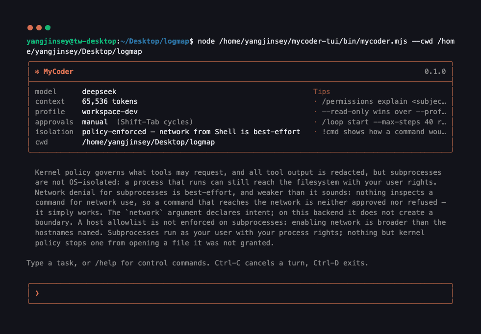
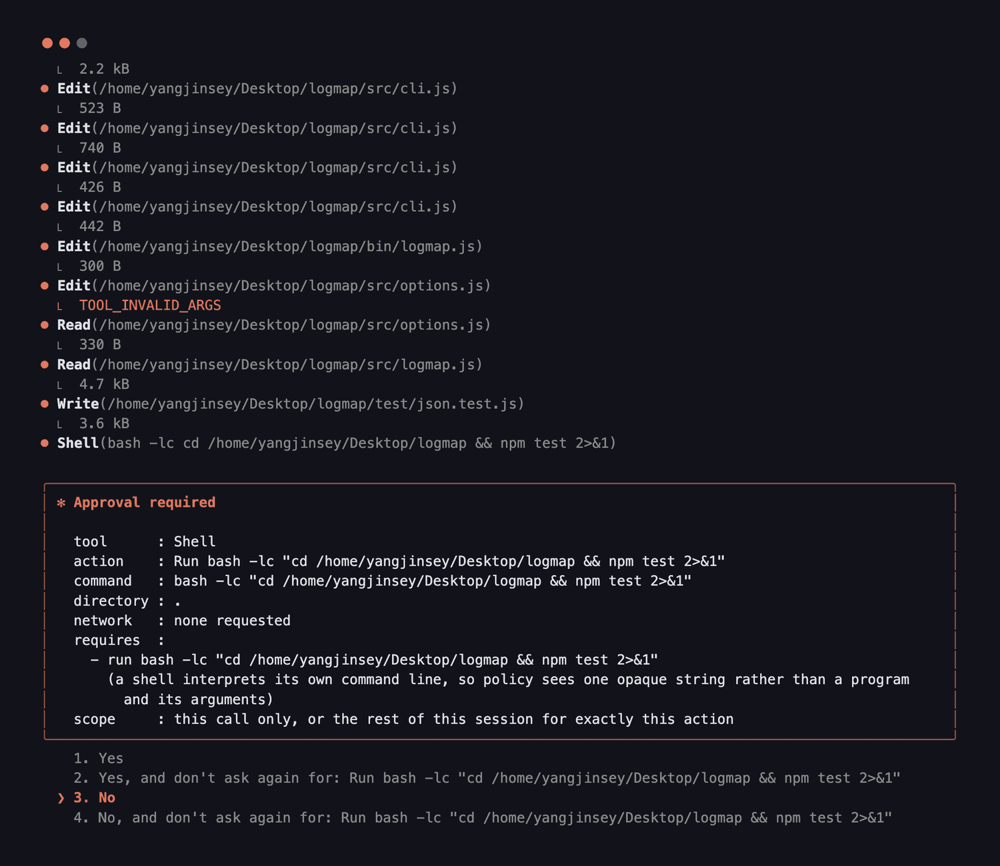

<div align="center">

# MyCoder

**一个终端里的编码 agent 内核 —— 单进程、零运行时依赖，并且绝不夸大自己的强制级别。**

[](https://nodejs.org)
[](package.json)
[](docs/installing.md)

[English](README.md) · **简体中文**



</div>

---

把它指向一个仓库，描述一个任务。它会读文件、改文件、跑你的测试、再检查自己干得怎么样；
而它发出的每一次工具调用，都会先被解析成一个 `AccessRequest`，由策略引擎在工具**做任何事
之前**给出裁决。引擎裁决了什么，和它实际能强制什么，是两个不同的问题 ——
MyCoder 在第一屏就回答第二个，逐维度回答，并且用的是真正在做强制的那个机制的词汇。

## 安装

Node **22.18+**。没有任何运行时依赖，供应链就到这里为止。

```bash
npm install -g mycoder-cli@alpha    # 包名是 mycoder-cli，命令是 mycoder
mycoder doctor
```

```bash
brew tap OIerYangJZ/mycoder
brew trust OIerYangJZ/mycoder   # Homebrew refuses to load a third-party tap without this
brew install mycoder
```

```bash
# 从这个仓库的 checkout 出发
pnpm install && pnpm build
node bin/mycoder.mjs doctor
```

<sub><code>@alpha</code> 是因为它确实是 alpha：版本号是 <code>0.1.0-alpha.13</code>，
显式写出来才算你是有意装预发布版。它发在 <code>alpha</code> 这个 dist-tag 下 ——
不过 npm 会把 <code>latest</code> 钉在一个包首次发布的那个版本上，而且不允许删除，
所以在有稳定版把它挪走之前，<code>latest</code> 也指向这里。
npm 上的包名叫 <code>mycoder-cli</code>，因为 <code>mycoder</code> 已经属于另一个
无关项目。装完之后你敲的仍然是 <code>mycoder</code>。每次发布上传的都是发布门禁
真正装过、跑过的那个 tarball，并附带
<a href="https://docs.npmjs.com/generating-provenance-statements">npm provenance</a>
—— 所以 registry 上的字节就是被测过的字节，这件事你可以自己验，不必信这里的话。</sub>

**第一次用？**[`docs/using-mycoder.md`](docs/using-mycoder.md) 从头到尾走一遍
真实会话 —— 审批弹窗、四种模式、怎么看它改了什么、以及长任务怎么把控。（英文）

`doctor` 只会得出两个结论之一，不会有第三个 —— **就绪**，或者**被挡住**，
并说出要创建哪个文件、往里放哪个 key、以及哪条命令能证明它生效了。
它不建立会话，也不写任何东西，因为它正是 `mycoder` 起不来时你会去敲的那条命令。

| 平台              | 层级 | 可用后端                             |
| ----------------- | ---- | ------------------------------------ |
| Linux x64 / arm64 | 1    | `local`、`container`、`linux-native` |
| macOS arm64 / x64 | 1    | `local`、`container`                 |
| Windows x64       | 2    | `local`                              |

## 配置一个 provider

内置 **Anthropic Messages**、**OpenAI Responses**、**OpenAI 兼容 Chat** 三种适配器 ——
DeepSeek、OpenRouter、Together、本地的 llama.cpp 都能接。外加一个 `fake` 适配器，
这也是整个内核能离线测试的原因。

凭据只从 stdin 读，绝不从终端读，所以它不会回显到你屏幕上，也不会进 shell 历史：

```bash
printf %s "$YOUR_API_KEY" | mycoder setup-credential ~/.config/mycoder/secrets/deepseek.key
```

```toml
# ~/.config/mycoder/config.toml
[model.provider.deepseek]
protocol     = "openai-chat"
base_url     = "https://api.deepseek.com"
api_key_file = "secrets/deepseek.key"

[model.profile.deepseek-chat]
context_window    = 65536
max_output_tokens = 8192
input_per_mtok    = 0.14      # 不写价格，花费就报 `unknown`，绝不猜一个数字出来
output_per_mtok   = 0.28

[model.alias.deepseek]
provider = "deepseek"
model    = "deepseek-chat"
profile  = "deepseek-chat"

[model]
default = "deepseek"
```

## 一次会话

```console
$ mycoder
❯ read src/bars.js and src/format.js, then explain how one chart row is laid out

⏺ Read(src/bars.js)
⏺ Read(src/format.js)
  ⎿  Read(src/bars.js) · 4.8 kB
  ⎿  Read(src/format.js) · 2.0 kB
One chart row is laid out in renderRows in bars.js as a single string made of
three fixed-width columns separated by single spaces: a left-aligned label column
(middle-truncated to labelW by truncateMiddle, then padded), a bar column holding
rune repeated scaleCells(row.value, max, barW) times and padded to barW, and a
right-aligned count column padded via padStart(countW). …

✻ Worked for 5s
  read 2 files
  deepseek · 66k ctx · 2 requests · 9.5k tokens · $0.0008
```

结果按调用归属，不按位置 —— 一步里发出四个 `Read`，四个结果按完成顺序回来，
每一个都标出自己回答的是哪次调用。页脚的数字来自会话自己的事件日志，
而不是模型对自己的转述；被拒绝的部分和做成的部分分开报。

| 输入                | 效果                                        |
| ------------------- | ------------------------------------------- |
| `@src/thing.ts`     | 附带一个文件；Tab 在工作区内补全路径        |
| `/…`                | 控制命令，由内核直接处理，绝不发给模型      |
| `!npm test`         | 打印这一行会被解析成什么 argv —— 并不真的跑 |
| **Shift-Tab**       | 循环切换审批模式                            |
| **Ctrl-R**          | 反向历史搜索                                |
| **Ctrl-C / Ctrl-D** | 取消这一轮 / 结束会话                       |

给自动化用的话，`--json` 在 stdout 上一行一个对象，除此之外什么都没有 ——
所有装饰性输出走 stderr，所以 `mycoder … | jq` 永远不需要先把人看的文字滤掉：

```console
$ mycoder --json "fix add()"
{"schema":"mycoder.v1","type":"turn","state":"completed","steps":1,"text":"…","exit":0}
```

## 到底强制了什么

六个维度，五个级别 —— `none`、`best-effort`、`policy-enforced`、
`container-enforced`、`os-enforced` —— 按后端逐一报告，而且是从后端自己的描述符推导出来的，
不是 CLI 自己声称的。`/status` 打印这张表，启动横幅用散文打印同一件事。

| 维度                              | `local`         | `--remote`（SSH） | `--backend container` | `linux-native`（实验性）               |
| --------------------------------- | --------------- | ----------------- | --------------------- | -------------------------------------- |
| 子进程文件系统                    | policy-enforced | policy-enforced   | container-enforced    | **os-enforced**（Landlock）            |
| 子进程网络                        | best-effort     | best-effort       | container-enforced ¹  | os-enforced（仅 TCP）¹                 |
| 子进程特权                        | none            | none              | container-enforced ²  | os-enforced（seccomp、`no_new_privs`） |
| 环境隔离                          | policy-enforced | policy-enforced   | container-enforced    | policy-enforced                        |
| **宿主文件代理**（`Read`/`Edit`） | policy-enforced | policy-enforced   | **policy-enforced**   | **policy-enforced**                    |
| 网络主机白名单                    | best-effort     | best-effort       | container-enforced    | none                                   |

<sub>¹ 当有拒绝或主机白名单在生效时；网络不受限时是 `none`。² 需要只读根文件系统；没有它则是 `best-effort`。</sub>

请横着读加粗那一行。这个产品里最强的沙箱**并不覆盖 `Read` 和 `Edit`** ——
它们是内核在你真实文件系统上的受信任操作，把它们报告成"已容器化"，
正是这整套机制存在的意义所要杜绝的那种夸大。接上一个 MCP server，
还会多出第七个维度 `foreignToolEffects`，而它唯一诚实的取值是 `none`：
内核没法在别人的进程内部强制一条边界。

上表 `local` 那一列的散文版，在你敲第一个字之前就会打印出来：

> …subprocesses are not OS-isolated: a process that runs can still reach the
> filesystem with your user rights. Network denial for subprocesses is
> best-effort, and weaker than it sounds: nothing inspects a command for network
> use, so a command that reaches the network is neither approved nor refused — it
> simply works.
>
> （……子进程没有 OS 级隔离：一个跑起来的进程仍然能用你的用户权限碰到文件系统。
> 对子进程的网络拦截是尽力而为，而且比听上去更弱：没有任何东西会去检查一条命令
> 是否用到网络，所以一条真的连了外网的命令，既没有被批准也没有被拒绝 —— 它就是跑通了。）

## 权限

工具绝不会先动手再汇报。`ToolDefinition → ToolExecution → AccessRequest`
之所以是两阶段的：执行阶段先声明它打算要什么 —— `file.read`、`file.write`、
`file.delete`、`process.exec`、`network.connect`、`secret.use`、`env.read`、
`vcs.mutate`、`remote.connect`、`agent.invoke`、`mcp.invoke` —— 策略引擎针对这份
**描述**给出 `allow` / `ask` / `deny`，此时任何副作用都还不存在。

权限档按**交集**组合，所以没有任何一层能放宽另一层：

| 权限档          | 它自己的描述                                                                 |
| --------------- | ---------------------------------------------------------------------------- |
| `workspace-dev` | Edit the workspace and run local verification. Network and VCS mutation ask. |
| `read-only`     | Inspect the workspace. No writes, no network, no VCS mutation.               |
| `review`        | Read and run verification commands. No writes, no network.                   |

`--read-only` 压过 `--profile`，而且会明说，不会悄悄替你解析掉。

审批模式只能替你回答引擎本来就决定要问的问题 —— 它造不出权限档已经拒绝的权限。
Shift-Tab 循环切换：

| 模式           | 不问你就替你回答的能力                         |
| -------------- | ---------------------------------------------- |
| `plan`         | 无；它叠加一层只读，所以改动是被_拒绝_而非婉拒 |
| `manual`       | 无（默认）                                     |
| `accept-edits` | 工作区内的 `file.write`                        |
| `auto`         | 再加上 `file.delete` 和 `process.exec`         |

这张表就是全部 —— `AUTO_ANSWERED` 只列了三种能力，没有任何模式能伸到它们之外。
所以 `secret.use`、`network.connect`、`vcs.mutate`、`mcp.invoke` 在**每一种**模式下
都会问，`auto` 也不例外。一个本来就需要审批的 `file.read` 同样如此 ——
读工作区之外的东西，永远不会有模式替你答应。而 `env.read` 是一条硬拒绝，
在任何模式下都不可能变成一次审批。

起始模式只从你自己的配置读 —— 仓库里的 `[security] approval_mode` 会被忽略，
因为一个仓库无权决定它的代码跑之前要不要问你。



提示框给的是语义，不是命令字符串：哪个主体、涉及哪些访问、这次授权持续多久。
一次会话级授权是记在一个具体的 subject key 上的 —— 比如
`process.exec:npm:install` —— 而绝不是一整类能力。高亮默认停在 **No**；
Escape 和 Ctrl-C 都解析为拒绝，而不是把这一轮悬在那里。

## 工具

**九个核心工具：** `Read`、`Grep`、`Glob`、`Edit`、`Write`、`Delete`、`Move`、
`Shell`、`GitDiff` —— 全部走上面那套契约。

| 工具                 | 声明的能力                                                   | 说明                                                                                       |
| -------------------- | ------------------------------------------------------------ | ------------------------------------------------------------------------------------------ |
| `Read` `Grep` `Glob` | `file.read`                                                  | 存放凭据的路径是直接拒绝，而不是脱敏                                                       |
| `Edit`               | `file.write`                                                 | 必须引用覆盖了该区域的那次 `Read` 的 `receiptId`，否则返回 `STALE_FILE`                    |
| `Write`              | `file.write`                                                 | 覆盖一个已存在的文件，需要对它的完整读取覆盖                                               |
| `Move`               | `file.delete` + `file.write`                                 | 一次调用两种能力，两个都在移动发生之前裁决                                                 |
| `Delete`             | `file.delete`                                                | 独立的一种能力，所以它会在普通写入不问的地方发问（ADR-0016）                               |
| `Shell`              | `process.exec`，以及每个像路径的 argv token 一个 `file.read` | 是 argv 而不是字符串 —— 所以 `cat .env` 是硬拒绝，而不是一个脱敏问题                       |
| `GitDiff`            | `process.exec` + `file.read`                                 | 调用 `git`；diff 是读出来的，从不写回                                                      |
| `WebFetch`           | `network.connect`                                            | 只有 `[egress] web` 点名了主机时才注册。只允许 GET、不跟随重定向、响应一律按不可信输入处理 |

写入是原子的，带 unified diff、回滚元数据，并保持你原来的行尾。
`/undo` 可以撤销一次编辑、一轮的编辑、或一个文件的编辑 —— 要么全撤要么一个不撤 ——
并且会列出它**没有**覆盖到什么：shell 命令的副作用，以及日志开始之前的一切。

## 控制平面

`/model` `/effort` `/goal` `/loop` `/mode` `/permissions` `/status` `/compact`
`/remote` `/skills` `/agents` `/hooks` `/diff` `/undo` `/cancel` `/verbose`
`/thinking` `/help` —— 每一条都直接改内核状态，绝不经过模型。`/loop` 给一轮设定步数、
墙钟时间和花费预算；`/compact` 压缩较早的对话，并在压不动时如实说；
`/diff` 用 `/undo` 反向应用的那同一份日志，显示这次会话改了什么；
`/permissions explain <subject>` 解释某个裁决为什么是那样。

会话是一份只追加的事件日志。`mycoder -c` 接着这个工作区最近一次；
`mycoder -r` 按「当时让它做什么」把它们列出来。恢复时会从日志重建编辑日志，
所以一次 undo 能在崩溃后幸存；被打断的工具调用会被合成结果补齐。

## 退出码

在 `0.1.x` 之内是一份契约，所以包装脚本不用解析英文就能分支。

|                |                                      |                      |          |
| -------------- | ------------------------------------ | -------------------- | -------- |
| `0` 成功       | `1` 没做完 —— 放弃、撞预算、被取消   | `2` 命令行用法       | `3` 配置 |
| `4` 被策略拒绝 | `5` 环境不具备 —— 运行时、后端、网络 | `6` MyCoder 自身缺陷 |          |

没有任何一个大于 6：`127` 和 `128` 往上是 shell 的地盘，借用它们会让我们的失败
和它的分不出来。工具层面的失败有自己的错误码 —— `STALE_FILE`、`TOOL_DENIED`、
`PROTECTED_PATH`、`INSUFFICIENT_READ_COVERAGE`、`LOOP_BUDGET_EXCEEDED` ——
每一个都带固定的归责方。

## 架构

```
User / CLI  →  Control Plane
                    ↓
        Session / Turn Coordinator
                    ↓
              Step Engine
   ┌────────────┼────────────┐
   ▼            ▼            ▼
Context   Model Runtime  Tool Runtime
Engine          │             │
                ▼             ▼
          Egress Gate   Tool.resolve() → Policy Engine
                                              ↓
                                        Sandbox Planner
                                              ↓
                                        Executor / Backend
                                              ↓
                                         Audited Result
```

所有出站字节只过一道 egress gate，每个通道各有自己的主机白名单，
遥测通道只走元数据。密钥存在一个 broker 里，它的租约没法被字符串化回原值。
工具输出在模型看到之前会被扫描。skills、子 agent 和 hooks 从仓库里发现，
遵守同一条规则：一份定义只能收窄权限，永远不能放宽。

## 这一版没有的东西

MCP 市场、agent 团队、IDE 插件、完整 TUI、浏览器操作、embedding、仓库地图、
模型路由、云端会话同步、后台守护进程。每一个都留了以后接上去的位置；
现在没有一个是做了一半横在路中间的。

## 文档

|                                  |                                           |
| -------------------------------- | ----------------------------------------- |
| `docs/installing.md`             | 平台层级，以及首次运行的完整流程          |
| `docs/configuring-a-provider.md` | 每个字段、本地模型、花钱之前怎么先验证    |
| `docs/cli-contract.md`           | 每个 flag 和退出码，以及 `0.1.x` 保证什么 |
| `docs/web-access.md`             | 怎么启用 `WebFetch`，以及它不会做什么     |
| `docs/threat-model.md`           | 它防住了什么，没防住什么                  |
| `docs/development.md`            | 怎么构建、怎么测试，以及仓库是怎么组织的  |
